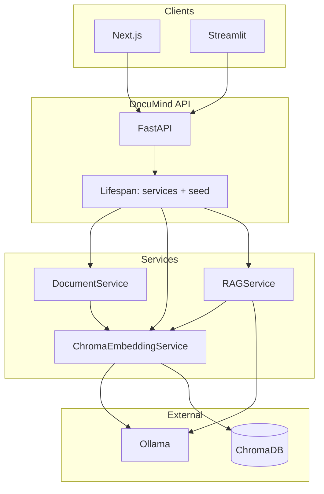

# DocuMind — Technical Reference

DocuMind is a **local-first RAG** stack: two Chroma collections (**public** default, **papers** for PDFs/DOCX/text/arXiv), FastAPI with per-request `library`, chunking and cosine retrieval, and citations in responses. Inference defaults to **Ollama** on your hardware. Bulk public text is indexed offline; the web UI is a status and query client over the same REST API.

This document covers **architecture**, **configuration**, **API behavior**, and **deployment** for handoff and extension.

---

## Table of contents

1. [System overview](#1-system-overview)  
2. [Design principles](#2-design-principles)  
3. [Repository layout](#3-repository-layout)  
4. [Runtime architecture](#4-runtime-architecture)  
5. [Data lifecycle: ingest → index](#5-data-lifecycle-ingest--index)  
6. [Retrieval and generation pipeline](#6-retrieval-and-generation-pipeline)  
7. [Query modes](#7-query-modes)  
8. [Retrieval strategies and ablation](#8-retrieval-strategies-and-ablation)  
9. [HTTP API](#9-http-api)  
10. [Configuration](#10-configuration)  
11. [Security middleware](#11-security-middleware)  
12. [Observability and reliability](#12-observability-and-reliability)  
13. [Deployment](#13-deployment)  
14. [Bundled corpus and scripts](#14-bundled-corpus-and-scripts)  
15. [Testing](#15-testing)  
16. [Known limitations and extension points](#16-known-limitations-and-extension-points)  
17. [Portfolio artifacts](#17-portfolio-artifacts)  
18. [References](#18-references)  
19. [Delivery scope, limits, and scale](#19-delivery-scope-limits-and-scale)  
20. [Scale runbook (capacity + cloud migration)](docs/SCALE_OPERATIONS_PLAYBOOK.md) — §9 cloud stages and service mapping.

---

## 1. System overview

| Layer | Responsibility |
|-------|------------------|
| **Presentation** | Next.js 15 (`web/`): status, diagnostics, and query UI against the REST API. Optional Streamlit (`frontend/app.py`). |
| **Application** | FastAPI application (`app/main.py`): routing, middleware, dependency injection, lifespan-managed singletons. |
| **Domain services** | Document parsing and chunking (`app/services/document_service.py`, `app/utils/chunker.py`); vector persistence (`app/services/embedding_service.py`); RAG orchestration (`app/services/rag_service.py`). |
| **Model I/O** | Ollama client (`app/utils/ollama_client.py`): chat completions and per-text embeddings over HTTP. |
| **Persistence** | Chroma persistent client on disk (`CHROMA_PERSIST_DIR`); **two** collections — `CHROMA_COLLECTION_PUBLIC` (encyclopedia-scale) and `CHROMA_COLLECTION_NAME` (papers / PDFs / arXiv; legacy env name for the non-public index). Cosine space (`hnsw:space: cosine`). |

**Ports (convention):** API **8001**, Next.js dev **3002**, Ollama **11434**.

---

## 2. Design principles

1. **Grounding first** — Final user-facing answers for LLM-backed modes are conditioned only on retrieved chunk text; prompts explicitly forbid inventing papers, metrics, or datasets absent from context.  
2. **Explicit provenance** — Responses include `SourceCitation` objects (document id, title, section, page hint, chunk index, distance, preview).  
3. **Dependency-aware serving** — **Liveness** vs **readiness** split so orchestrators can distinguish “process up” from “dependencies usable”.  
4. **Configurable retrieval policy** — Top‑k, distance cutoff, keyword rerank weight, fallback when strict filtering returns nothing, and diversity caps are all **environment-tunable**.  
5. **Single-tenant baseline** — One shared library index per deployment; ACLs per document are **not** implemented in-tree (see [§16](#16-known-limitations-and-extension-points)).

---

## 3. Repository layout

| Path | Role |
|------|------|
| `app/main.py` | FastAPI app, lifespan, global exception handler, middleware, router includes. |
| `app/config.py` | `pydantic-settings` `Settings`; single cached `get_settings()`. |
| `app/logging_config.py` | Optional JSON logging layout. |
| `app/routers/ingest.py` | Multipart ingest, delete by `doc_id`. |
| `app/routers/papers.py` | List / get / delete paper metadata from index. |
| `app/routers/query.py` | RAG query and collection stats. |
| `app/routers/arxiv.py` | arXiv PDF fetch by id. |
| `app/services/document_service.py` | File type detection, text extraction, delegation to chunker. |
| `app/services/embedding_service.py` | Chroma add/query/delete; Ollama embeddings. |
| `app/services/rag_service.py` | Retrieval, rerank, diversity, mode prompts, FLARE branch, Ollama chat. |
| `app/utils/chunker.py` | `RecursiveCharacterTextSplitter`; section heuristics in metadata. |
| `app/utils/ollama_client.py` | Retry-wrapped HTTP to Ollama `/api/chat` and `/api/embeddings`. |
| `app/models/` | Pydantic request/response models shared by routers. |
| `data/sample_docs/` | Bundled UTF-8 corpus (see [§14](#14-bundled-corpus-and-scripts)). |
| `tests/` | API and unit tests; `tests/conftest.py` uses dependency overrides and fake embedding/RAG for isolation. |
| `evaluation/` | Optional regression fixtures for pipeline shape. |
| `scripts/` | Corpus generators, portfolio PDF, arXiv bulk helpers. |
| `web/` | Next.js client for the API. |
| `Dockerfile` / `docker-compose.yml` | Container image (Python 3.11-slim, non-root) and Compose stack with Chroma volume + healthcheck. |

---

## 4. Runtime architecture



**Lifespan (`app/main.py`):** On startup, constructs `OllamaClient`, one shared **`chromadb.PersistentClient`** on `CHROMA_PERSIST_DIR`, then an **`EmbeddingRegistry`** with two **`ChromaEmbeddingService`** wrappers (papers + public collections) and two **`RAGService`** instances (`content_library` each). Sharing one client avoids double-opening the same SQLite store. When **`SEED_SAMPLE_DOCS=true`** (off by default; legacy DS demo path), runs **`seed_sample_docs`** into the **papers** collection only: compares `SAMPLE_CORPUS_VERSION` marker on disk to settings; on mismatch, deletes `sample_*` vectors in that collection, rewrites marker, then ingests each `data/sample_docs/*.txt` as `sample_<stem>`. **Wikipedia-first:** keep `SEED_SAMPLE_DOCS=false` and grow **`CHROMA_COLLECTION_PUBLIC`** via **`scripts/bulk_index_public.py`** / **`scripts/build_public_corpus.py`** (or `POST /api/v1/ingest` with `library=public`).

**Routers** mount under `/api/v1` except health routes at root.

---

## 5. Data lifecycle: ingest → index

### 5.1 Ingestion

- **Input:** `POST /api/v1/ingest` (`multipart/form-data`: file + optional `library` field, default **`public`**) or `POST /api/v1/fetch-arxiv` (JSON `arxiv_id`; always indexes **papers**).  
- **Validation:** File size cap `MAX_FILE_SIZE_MB`; MIME/type checks in ingest router / document service.  
- **Extraction:** PyPDF2 for PDF, python-docx for DOCX, raw decode for `.txt`.  
- **Metadata:** Heuristic title, authors, year, optional arXiv id from leading text when parseable.  
- **Chunking:** `DocumentChunker` uses LangChain `RecursiveCharacterTextSplitter` with `CHUNK_SIZE` and `CHUNK_OVERLAP`. Each `langchain_core.documents.Document` carries metadata: `doc_id`, `filename`, `section` (heuristic), `chunk_index`, `page_number` when known, etc.  
- **Indexing:** `ChromaEmbeddingService.add_documents` (HTTP path) or **`add_indexed_batch`** (bulk indexer) embeds chunks via Ollama `EMBEDDING_MODEL`, writes to the selected collection with stable ids `{doc_id}_{i}`. Each chunk metadata is stamped with **`embedding_model`**, **`chroma_collection`**, and **`indexed_at`** (UTC) for re-embed and drift workflows.  

### 5.2 Deletion semantics

`DELETE /api/v1/papers/{doc_id}` and `DELETE /api/v1/ingest/{doc_id}` call `embedding_service.delete_document`. If no chunks exist for that `doc_id`, the service returns **false** and the API responds **404** — empty delete is not silently successful.

### 5.3 Vector space

Each Chroma collection is created with `metadata={"hnsw:space": "cosine"}`. Query results expose **distance** per hit; the RAG layer sorts ascending (**lower distance = closer match**) and keeps rows under the **library-specific** distance cutoff (`RELEVANCE_THRESHOLD` vs `PUBLIC_RELEVANCE_THRESHOLD`) before optional fallback.

### 5.4 `section_filter` and library

`section_filter` applies to Chroma `where` on metadata `section`. **Papers** (PDFs / arXiv): values mirror paper-heading heuristics (`abstract`, `methodology`, …). **Public** (Wikipedia-style `.txt`): most chunks are **`body`**; restrictive filters often return **no hits** — omit `section_filter` for broad public queries unless you control chunk metadata.

---

## 6. Retrieval and generation pipeline

All logic below is implemented in `app/services/rag_service.py` unless noted.

### 6.1 Retrieval budget

For a user `top_k` and `query_mode`, the service expands the **vector search** `n_results` before reranking. **Papers** library: up to **64** candidates for `general` / `compare` (roughly `4× top_k`, capped). **Public** (encyclopedia) library: wider pool (**cap 96**, multiplier **5×** `top_k` for `general`/`compare`) to improve recall on long prose. Other modes use a slightly smaller cap for public.

### 6.2 Vector search and rerank

1. `embedding_service.search(embed_query, retrieve_k, section_filter)` returns rows `{content, metadata, distance}`.  
2. **Keyword rerank:** Rows are sorted by  
   `distance − W × keyword_overlap_score(rerank_query, content)`  
   where `W` is **`KEYWORD_RERANK_WEIGHT`** (papers) or **`PUBLIC_KEYWORD_RERANK_WEIGHT`** (public).  
3. **Threshold filter:** Keep rows with `distance <` **`RELEVANCE_THRESHOLD`** (papers) or **`PUBLIC_RELEVANCE_THRESHOLD`** (public). Compare mode adds a small slack bump (see `rag_service.py`).  
4. **Fallback:** If nothing passes and `ENABLE_FALLBACK_RETRIEVAL` is true, take the top `FALLBACK_TOP_N` by rerank order and mark internally (answer may append a disclosure line).  
5. **Diversity:** `_select_diverse_sources` prefers at most one strong chunk per `doc_id` before filling remaining slots, reducing single-document context monopolization.  
6. **Context slot cap:** Depends on `query_mode` (e.g. up to 24 chunks for `general` / `compare`).

### 6.3 Generation

- **`datasets` mode:** Does **not** call the LLM for the main body. It scans retrieved chunk text for known dataset hints and patterns, emits a structured Markdown inventory. FLARE is **skipped**.  
- **Other modes:** Builds a single context block from selected chunks, applies the mode’s system prompt (`SYSTEM_PROMPTS` for **papers**, `PUBLIC_SYSTEM_PROMPTS` for **public**), calls `OllamaClient.chat` with mode-dependent temperature, returns Markdown answer plus `SourceCitation` list.  
- **Confidence:** Derived from mean chunk distance (clamped); exposed as a scalar for UI.

---

## 7. Query modes

| `query_mode` | Papers library (`library=papers`) | Public library (`library=public`) |
|----------------|-------------------------------------|-------------------------------------|
| `general` | Broad grounded synthesis over research excerpts. | Same shape; prompts use **Article title** and encyclopedia-neutral tone. |
| `compare` | Cross-**paper** comparison; table-oriented. | Cross-**article** comparison; same table pattern with article titles. |
| `methodology` | Implementation-focused extraction from papers. | Process / mechanism extraction from encyclopedia prose. |
| `datasets` | Deterministic dataset / benchmark hints from chunk text. | Same scanner; useful when excerpts name corpora (e.g. “Wikipedia”). |
| `reproduce` | Reproducibility checklist for experiments. | “What could be reproduced from excerpts” framing. |

Optional **`section_filter`** — see [§5.4](#54-sectionfilter-and-library).

---

## 8. Retrieval strategies and ablation

**Default:** `retrieval_strategy=baseline` — single dense-vector pass, keyword rerank, distance threshold, source diversity, then generation.

**Request fields:** `retrieval_strategy` (`baseline` | `flare` | `hyde` | `multi_query`), legacy `use_flare` (maps to `flare` when strategy is `baseline`), and `retrieve_only` (skip final answer LLM — for benchmarks).

| Strategy | Mechanism | Extra LLM calls |
|----------|-----------|-----------------|
| **baseline** | Embed user query → Chroma → rerank → filter | 0 |
| **flare** | Same first pass; forward-looking draft; second search if draft has `???` or hedges | 0–1 draft |
| **hyde** | LLM writes hypothetical passage; **embed that** for search (Gao et al., HyDE) | 1 |
| **multi_query** | LLM emits up to 3 sub-queries; search each; **RRF** fuse ranks | 1 |

`datasets` mode always uses baseline extraction (no strategy LLM helpers).

### 8.1 FLARE-inspired (not paper-faithful)

Full **FLARE** ([Jiang et al., arXiv:2305.06983](https://arxiv.org/abs/2305.06983)) triggers retrieval from **token-level confidence** during generation. Ollama chat here does **not** expose logprobs, so **flare** uses a short draft with explicit `???` / “not stated in excerpt” hedges and `flare_triggers_follow_up()` to gate a second pass.

### 8.2 Systematic comparison (live API)

```powershell
# API + Ollama up, public corpus indexed
.\.venv\Scripts\python scripts\run_retrieval_ablation.py --base-url http://127.0.0.1:8001 `
  --report-md evaluation/reports/retrieval_ablation.md `
  --csv evaluation/reports/retrieval_ablation.csv `
  --json-out evaluation/reports/retrieval_ablation_summary.json
```

Benchmark cases: `evaluation/retrieval_ablation.json` (8 probes) or `--bench evaluation/wiki_public_bench.json`. The script prints per-strategy **grounded rate**, **latency p50/p95**, **avg unique docs**, and **Jaccard overlap vs baseline** for slide-ready Markdown.

**Stakeholder visuals:** Offline scores → `python scripts/run_retrieval_ablation_offline.py` then `python scripts/refresh_stakeholder_views.py` → open `evaluation/reports/stakeholder_dashboard.html`. In Cursor, open canvas **documind-retrieval-scores** (charts + per-query scorecard).

### 8.3 Other approaches (documented, not default)

| Approach | Why not default in this repo |
|----------|------------------------------|
| Token-level FLARE | Needs logprobs from the generator host |
| Self-RAG / CRAG | Heavy orchestration for a local demo |
| Cross-encoder rerank | Strong in prod; kept Ollama-only for clone-friendly deploys |

---

## 9. HTTP API

| Method | Path | Body / params | Notes |
|--------|------|---------------|--------|
| GET | `/health` | — | Ollama availability + stats for **`DEFAULT_LIBRARY`** collection. |
| GET | `/health/live` | — | Process liveness. |
| GET | `/health/ready` | — | **503** if dependencies not ready. |
| GET | `/api/v1/libraries` | — | **Both** collections’ `CollectionStats` + `default_library` (ops / capacity). |
| GET | `/api/v1/diagnostics` | — | **Operator snapshot:** API version, uptime, Python, active retrieval thresholds/weights, chunk defaults, both index counts, `DOCMIND_GIT_SHA` if set. |
| POST | `/api/v1/ingest` | `multipart/form-data`: `file`, optional `library` | Indexes into **public** or **papers**. |
| DELETE | `/api/v1/ingest/{doc_id}` | Query `?library=` (default `public`) | **404** if no chunks. |
| POST | `/api/v1/fetch-arxiv` | `{ "arxiv_id": "..." }` | Downloads PDF; indexes **papers** only. |
| POST | `/api/v1/query` | `QueryRequest` JSON (`library` default `public`) | See `app/models/request_models.py`. |
| GET | `/api/v1/papers` | Query `?library=` | Library cards. |
| GET | `/api/v1/papers/{doc_id}` | Query `?library=` | One document. |
| DELETE | `/api/v1/papers/{doc_id}` | Query `?library=` | **404** if no chunks. |
| GET | `/api/v1/collection/stats` | Query `?library=` | Aggregate counts for one collection. |

**OpenAPI:** `/docs`, `/redoc`, `/openapi.json` unless `DISABLE_OPENAPI=true`.

**Authentication:** When `API_KEY` is non-empty, all `/api/v1/*` routes (except CORS preflight) require header **`X-API-Key`** matching the setting; mismatch → **401**.

---

## 10. Configuration

All keys are listed in **`.env.example`**. Grouped reference:

| Group | Variables | Purpose |
|-------|-----------|---------|
| **Models** | `OLLAMA_BASE_URL`, `LLM_MODEL`, `EMBEDDING_MODEL`, `OLLAMA_REQUEST_TIMEOUT_SEC` | Inference endpoints, model tags, HTTP timeout for chat/embed (bulk-friendly). |
| **Vector store** | `CHROMA_PERSIST_DIR`, `CHROMA_COLLECTION_NAME` (papers), `CHROMA_COLLECTION_PUBLIC`, `DEFAULT_LIBRARY` | On-disk path; collection names; default `library` for `/health` stats. |
| **Chunking** | `CHUNK_SIZE`, `CHUNK_OVERLAP` | Text splitter parameters; affects chunk count and context granularity. |
| **Retrieval defaults** | `TOP_K_RESULTS`, `RELEVANCE_THRESHOLD`, `PUBLIC_RELEVANCE_THRESHOLD`, `PUBLIC_KEYWORD_RERANK_WEIGHT`, `ENABLE_FALLBACK_RETRIEVAL`, `FALLBACK_TOP_N`, `KEYWORD_RERANK_WEIGHT` | Papers vs **public** distance/lexical tuning; per-request `top_k` overrides for query. |
| **Ingest** | `MAX_FILE_SIZE_MB`, `ARXIV_BASE_URL` | Upload cap and arXiv PDF export host. |
| **Sample corpus (legacy)** | `SAMPLE_CORPUS_VERSION`, `SEED_SAMPLE_DOCS` | When `SEED_SAMPLE_DOCS=true`: bump version to purge/re-seed `sample_*` in **papers** only. Default **false** (Wikipedia-first). |
| **Network** | `CORS_ORIGINS`, `CORS_ALLOW_ALL`, `TRUSTED_HOSTS` | Browser and Host-header policy. |
| **App** | `APP_ENV`, `DISABLE_OPENAPI` | Environment label; docs toggle. |
| **Security / transport** | `API_KEY`, `ENABLE_RESPONSE_GZIP` | Optional API key gate; gzip responses. |
| **Logging** | `LOG_LEVEL`, `LOG_JSON` | Verbosity and JSON log lines. |
| **FLARE** | `FLARE_ACTIVE_RETRIEVAL`, `FLARE_DRAFT_MAX_CONTEXT_CHARS` | Global FLARE default and draft context budget. |

---

## 11. Security middleware

Applied in `app/main.py` (order matters for FastAPI / Starlette):

- **CORS** — `CORSMiddleware` with explicit origins or wildcard when `CORS_ALLOW_ALL` (dev-only).  
- **Trusted hosts** — Optional `TrustedHostMiddleware` when `TRUSTED_HOSTS` is set.  
- **Gzip** — `GZipMiddleware` when `ENABLE_RESPONSE_GZIP` and payload exceeds minimum size.  
- **Per-request** — `X-Request-ID` assignment, optional API key gate, default security headers (`X-Content-Type-Options`, `X-Frame-Options`, `Referrer-Policy`; `Permissions-Policy` in production `APP_ENV`).  
- **Errors** — `HTTPException` and `RequestValidationError` return structured JSON; uncaught exceptions return **500** with `request_id` in body.

---

## 12. Observability and reliability

- **Request correlation** — Every response carries `X-Request-ID`; access logs include `request_id`, method, path, status, `duration_ms`.  
- **Structured logs** — `LOG_JSON=true` for log platforms.  
- **Healthchecks** — Docker Compose defines an HTTP probe against `/health/live` (see `docker-compose.yml`). Prefer `/health/ready` for LB routing when Ollama and Chroma must be live.  
- **Chroma persist corruption (development)** — If opening the store raises a recoverable Chroma/Rust error (`APP_ENV=development`), the API **renames** `CHROMA_PERSIST_DIR` to a sibling `*.broken.<UTC>` folder, then **exits startup with `RuntimeError`**. **Restart the process once** so a fresh Python interpreter opens the new empty directory (PyO3 panics can poison in-process bindings; an immediate re-open in the same process is unsafe). Production/staging surfaces the error without renaming.

---

## 13. Deployment

| Target | Command / notes |
|--------|------------------|
| **Docker Compose** | `docker compose up --build` — publishes **8001**, mounts Chroma volume `chroma_data`, read-only `./data`. Set `OLLAMA_BASE_URL` to reachable Ollama (default `host.docker.internal:11434` on Docker Desktop). |
| **Bare metal / VM** | `uvicorn app.main:app --host 0.0.0.0 --port 8001` (add `--proxy-headers` behind TLS terminator per your platform). |
| **Windows dev** | `.\start_documind.ps1` (Ollama, API, Next); uses `.venv\Scripts\python.exe` when present. **First boot** can sit in corpus ingest for a long time before `/health` responds; the script waits up to **180** minutes (`-MaxApiWaitMinutes`). `-SkipModelPull` speeds repeat boots. `.\stop_documind.ps1` clears ports **3002**, **8001**, **11434** — confirm Ollama shutdown is intended. |

**Backup:** Copy `CHROMA_PERSIST_DIR` regularly; it is the authoritative index. Source PDFs/DOCX should remain in object storage or VCS-independent archives if they are not all under `data/`.

---

## 14. Bundled corpus, public scale, and scripts

### Measured KB metrics (repo truth vs runtime)

| What | Where | Count / note |
|------|--------|--------------|
| `data/sample_docs/*.txt` | Git | **463** files total (**400** synthetic `sample_corpus_p7_*.txt`, **63** other curated/hand files). See [`data/sample_docs/README.md`](data/sample_docs/README.md). |
| Chunk rows for that bundle | Chroma **papers** only if `SEED_SAMPLE_DOCS=true` | **Not in git** — derived at index time from `CHUNK_SIZE` / overlap and text length (order of magnitude: low thousands to ~10k+ for the full bundle). |
| CI / pytest “corpus” | `tests/ranking_fake_embedding.py` | **6** synthetic `doc_id`s / **6** chunks — deterministic regression only. |
| Large public text | Disk + `CHROMA_COLLECTION_PUBLIC` | HF streaming scripts; bulk embed with checkpoint; respect CC BY-SA if you redistribute. |

**Strategic default:** **`library=public`** and **offline bulk index** are the flagship path; the DS `sample_docs` bundle is **legacy / optional demo** for the papers collection.

### What ships in git (small)

- **`data/sample_docs/`** — See table above and folder README. Optional demo material for **papers** when `SEED_SAMPLE_DOCS=true` (discouraged for Wikipedia-first deployments).  
- **Chroma in the repo clone** — Often **tens of MB** after local indexing; size grows with **chunk count × (vectors + stored text + HNSW)**. Empty **public** collection adds negligible disk until you bulk-index.

### Growing the public corpus

1. **`pip install datasets`** (for Hugging Face streaming).  
2. **One command (stream + bulk index):**  
   `python scripts/build_public_corpus.py --articles 10000`  
   Use `--articles 50000` or higher for serious scale; `--articles 0 --allow-unbounded` streams the full dump (disk-hungry).  
3. **Piecemeal:** `scripts/stream_wikipedia_to_txt.py` → `scripts/bulk_index_public.py` (`--dry-run` for chunk estimates, `--checkpoint` for resume, `--workers` for parallel Ollama embeds).  
4. **Ops:** `GET /api/v1/libraries` for both collections’ chunk and document counts.  
5. **Scale narrative + disk report:** [docs/SCALE_OPERATIONS_PLAYBOOK.md](docs/SCALE_OPERATIONS_PLAYBOOK.md); `python scripts/report_corpus_scale.py` (needs running API).  
6. **Public wiki RAG bench:** [evaluation/wiki_public_bench.json](evaluation/wiki_public_bench.json) — twenty grounded probes; run `python scripts/run_wiki_public_bench.py --base-url http://127.0.0.1:8001` (tune `PUBLIC_RELEVANCE_THRESHOLD` / `PUBLIC_KEYWORD_RERANK_WEIGHT` in `.env` if recall is thin on a small slice).

### Other scripts

- **Regeneration (legacy papers bundle):** `python scripts/generate_production_corpus.py --count 500 --force` then bump `SAMPLE_CORPUS_VERSION` (only with `SEED_SAMPLE_DOCS=true`).  
- **Hand-authored expansion:** `scripts/materialize_institutional_corpus.py`.  
- **arXiv bulk:** `scripts/bulk_ingest_arxiv.py` + `data/arxiv_seed_list.txt` (indexes **papers**).

---

## 15. Testing

```bash
pytest -q
```

`tests/conftest.py` overrides FastAPI dependencies with fake embedding/RAG services so unit tests do not require Ollama or Chroma.

**Query regression suite:** `tests/test_rag_query_suite.py` runs **20** parameterized cases (`tests/query_eval_cases.py`) against **real `RAGService`** with a **ranking fake vector layer** (`tests/ranking_fake_embedding.py`) and a deterministic Ollama stub — metrics cover status, `has_answer`, source counts, answer substrings, and wall time. **Live library smoke:** `python scripts/run_query_eval.py --base-url http://127.0.0.1:8001` (optional `--csv report.csv`; skips empty-corpus cases with `--skip-empty-corpus-cases`).

**CI:** On push and pull request to `main` or `master`, GitHub Actions (`.github/workflows/ci.yml`) runs on **Python 3.11 and 3.12**: `ruff check` (syntax / undefined-name rules), then **`pytest`**. No Ollama or Chroma in CI. Pytest and Ruff defaults: **`pyproject.toml`**. Dependabot for Actions: **`.github/dependabot.yml`**.

---

## 16. Known limitations and extension points

Not implemented in this repository (non-exhaustive):

- Per-user or per-tenant **ACL** on chunks or documents.  
- **SSO** / OIDC for the API or UI.  
- **OCR** pipeline for low-quality scanned PDFs beyond basic text extraction.  
- **Hosted** managed vector SaaS swap (Pinecone, Weaviate, etc.) — would replace `ChromaEmbeddingService` while preserving router contracts.  
- **Token-level FLARE** — requires a host that exposes logprobs or an alternative uncertainty model.  
- **Chroma auto-quarantine** — development-only; requires **one manual restart** after a bad on-disk store is moved aside (see [§12](#12-observability-and-reliability)).

Natural extensions: swap Ollama for OpenAI/Azure OpenAI behind the same `RAGService` boundary; add golden-set eval CI; wire `/health/ready` to load balancers; add cross-encoder reranking as an optional second stage.

---

## 17. Portfolio artifacts

Under **`portfolio/`**: client project catalog HTML, portfolio brief HTML, optional PDF generation (`scripts/portfolio_requirements.txt`, `scripts/generate_portfolio_pdf.py`), dashboard screenshot **`portfolio/screenshots/documind-dashboard.png`**.

**Regenerating the screenshot (recommended):** A bare `playwright screenshot` of the home page misses indexed doc counts and synthesis. Use the bundled driver after API + Next are up and sample ingest has progressed:

```powershell
.\.venv\Scripts\pip install -r scripts\screenshot_requirements.txt
.\.venv\Scripts\playwright install chromium
.\scripts\capture_dashboard.ps1                    # waits for /health/live, baseline public scenario, synthesis text, tall-viewport PNG
# Smaller corpus / faster index gate:  .\scripts\capture_dashboard.ps1 -MinDocs 5
# Custom API / wait cap:                .\scripts\capture_dashboard.ps1 -ApiBase "http://127.0.0.1:8001" -MaxLivenessWaitMinutes 240
```

Or directly: `.\.venv\Scripts\python scripts\capture_dashboard_playwright.py --help` — waits for **≥120 chars** in `.prose-answer`, scrolls synthesis into view, writes **1680×3200** `portfolio/screenshots/documind-dashboard.png` (default `--viewport-width 1680`; use `--viewport-width 1440` if needed), then **1000×750** `portfolio/screenshots/documind-upwork-catalog-1000x750.png` (default stack infographic tile; `--plain-catalog-thumb` top-crops the dashboard). Thumb only: `.\.venv\Scripts\python scripts\capture_dashboard_playwright.py --thumb-only`. Standalone tile: `python scripts/catalog_thumb_art.py --out portfolio/screenshots/documind-upwork-catalog-1000x750.png`. Avoid `--full-page` for portfolio assets.

---

## 18. References

- Jiang et al., *Active Retrieval Augmented Generation (FLARE)*, [arXiv:2305.06983](https://arxiv.org/abs/2305.06983).  
- Gao et al., *Precise Zero-Shot Dense Retrieval without Relevance Labels* (HyDE), [arXiv:2212.10496](https://arxiv.org/abs/2212.10496).  
- FastAPI, Pydantic v2, ChromaDB, LangChain text splitters, Ollama HTTP API.

---

## 19. Delivery scope, limits, and scale

### Cloud and larger deployments

For staged migration (compute split, managed inference, job-based ingest, vector tier, rate limits), use **[playbook §9](docs/SCALE_OPERATIONS_PLAYBOOK.md#9-cloud-production-migration-ladder)**.

### In scope (this repository)

- Dual corpora with explicit `library` routing; shared Chroma client, two collections; grounded answers with source list and distances.  
- Health: `/health`, `/health/live`, `/health/ready`; ops: `/api/v1/libraries`, `/api/v1/diagnostics`.  
- Retrieval: mode-specific budgets, keyword rerank, distance cutoffs (separate for public vs papers), optional second retrieval pass (FLARE-shaped), structured `datasets` extraction path.  
- Tests: `pytest` with fakes for CI; optional live checks via `scripts/run_query_eval.py`.

### Out of scope (state explicitly in SOWs)

- Per-tenant ACLs, SSO, billing, multi-region HA, managed vector SaaS (swap behind the same service boundaries is a separate project).  
- Full LLM+embed golden tests in CI (cost); run against a live stack when needed.

### Notable engineering choices

1. **One `PersistentClient`, two collections** — avoids double-opening the same SQLite path.  
2. **Chroma disk failures** — dev quarantine + process restart path; production needs backup/restore runbooks.  
3. **FLARE without logprobs** — follow-up retrieval is gated on draft heuristics (`rag_service`), bounded and testable.  
4. **CI RAG tests** — deterministic chat stub and ranking-aware fake embeddings in `tests/test_rag_query_suite.py`.

### Alternatives (design context)

See [§8.1](#81-alternatives-considered-and-why-this-flare-shaped-path): HyDE, multi-query fusion, cross-encoder rerank-only, self-RAG/CRAG vs the bounded second-pass path used here.

### Extensions that typically ship next

Cross-encoder rerank (feature-flagged), OpenTelemetry on retrieve vs generate, frozen eval JSONL per release, SLO table (p95 / error budget). Same playbook §9 for cloud hardening sequence.

---

## Stack summary

Python **3.11+** (Dockerfile pins 3.11-slim), FastAPI, Uvicorn, Pydantic Settings, ChromaDB, `langchain_core` + `langchain-text-splitters`, Ollama, Next.js 15, React 18, TypeScript, pytest, optional Streamlit.
